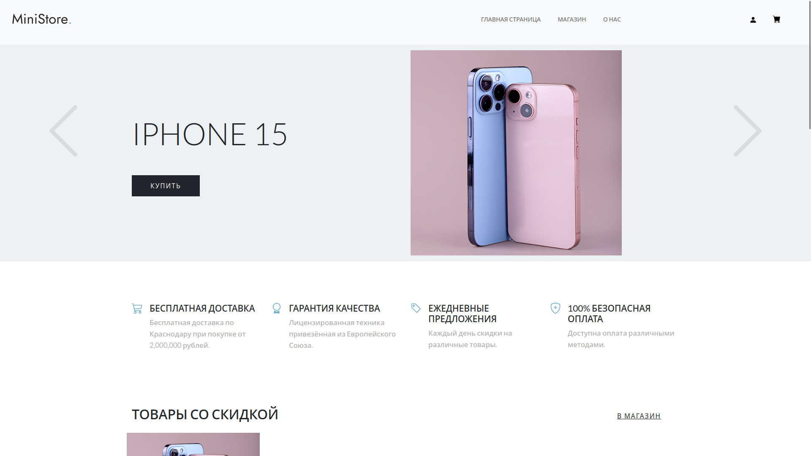

# Сайт "Магазин электроники"

Мой pet-проект - это платформа для покупки техники Apple.



### Cтек технологий:
* Python
* Django
* PostgreSQL
* Docker
* Celery
* Redis

# Установка

### Скопируйте проект.
  
```console
git clone https://github.com/NaiNaniNai/electronic-shop-site.git
```

### Настройте проект.
 * Создайте .env файл
 * Скопируйте содержимое .env_example в созданный файл:
 ```console
  cat .env_example > .env
 ```
 * Установите переменные в этом файле:
    * `DB_HOST=` <- Хост для БД
    * `DB_NAME=` <- Название БД
    * `DB_USER=` <- Имя пользователя БД
    * `DB_PASSWORD` <- Пароль пользователя БД
    * `DEBUG=` <- Дебаг режим
    * `SECRET_KEY=` <- Секретный ключ проекта
    * `EMAIL_HOST=` <- Хост вашего почтового сервиса (см. документацию почтового сервиса)
    * `EMAIL_PORT=` <- Порт вашего почтового сервиса (см. документацию почтового сервиса)
    * `EMAIL_HOST_USER=` <- Ваша почта
    * `EMAIL_HOST_PASSWORD=` <- SMTP пароль от почты (см.документацию почтового сервиса)
##### Если вы хотите использовать другую базу данных воспользуйтесь [официальной документацией Django](https://docs.djangoproject.com/en/5.0/ref/settings/#databases).
  * Выполните команду по сборке образа:
    ```console
    docker-compose build
    ```
  * Добавьте супер пользователя (администратора) Django, выполнив следующую команду:
    ```console
    docker-compose run --rm web sh -c "poetry run python manage.py createsuperuser"
    ```
### Запустите проект
  * Используйте команду:
    ```console
    docker-compose up
    ```
